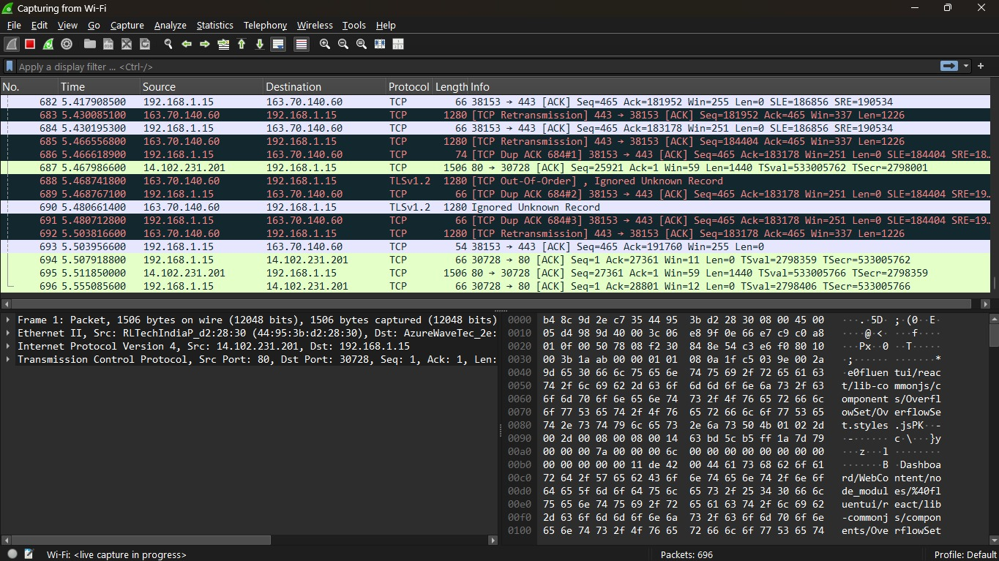
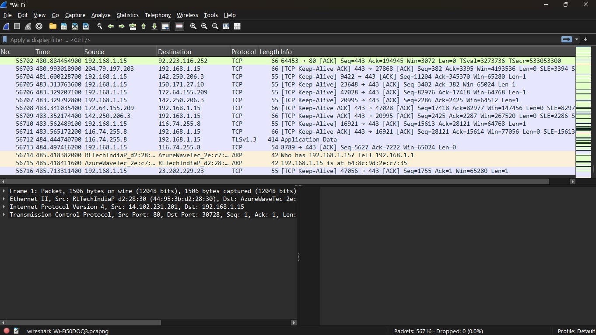
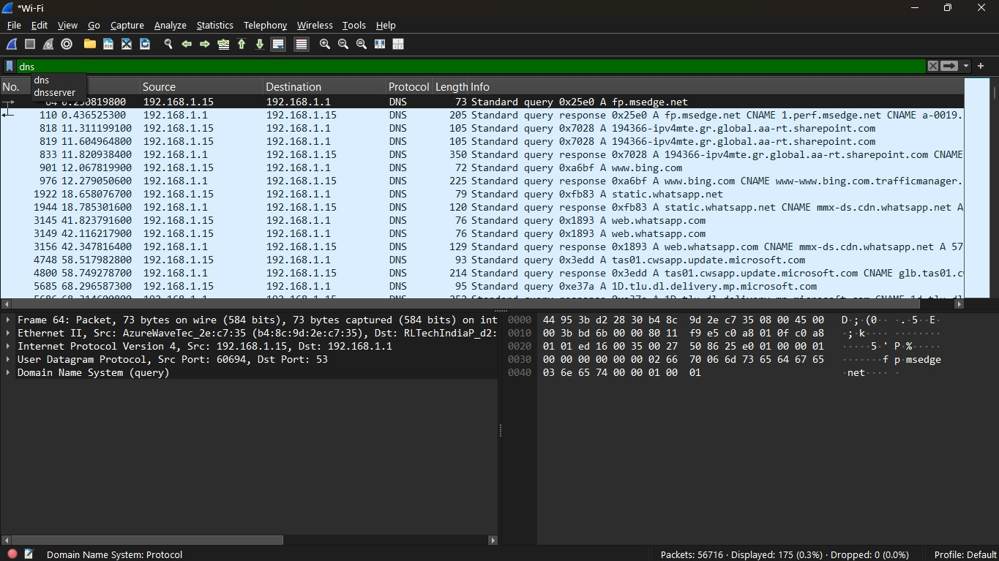
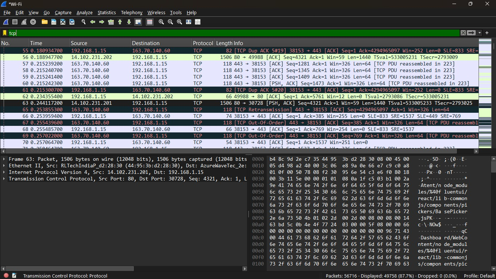
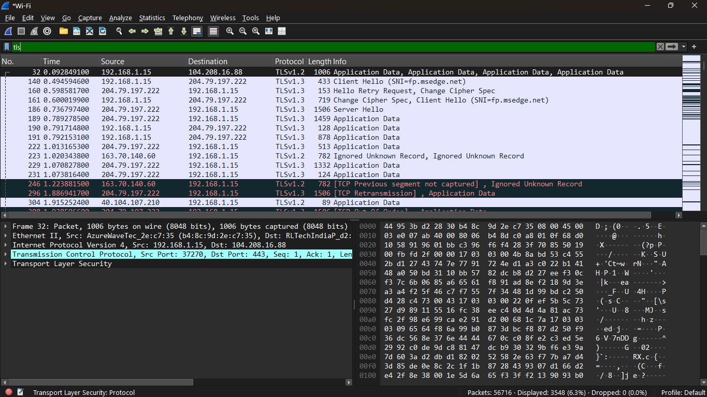

# elevate_labs_task5
# Network Traffic Capture and Analysis Using Wireshark

## Objective

The objective of this task was to capture live network traffic using Wireshark, analyze different network protocols, and understand how devices communicate over a network.

---

## Tools Used

- Wireshark 4.6.6
- Windows 11
- Google Chrome / Microsoft Edge
- Command Prompt

---

## Procedure

### 1. Install Wireshark

Wireshark was downloaded and installed from the official website.

### 2. Start Packet Capture

- Opened Wireshark.
- Selected the active Wi-Fi network interface.
- Started packet capture.

  

### 3. Generate Network Traffic

Network traffic was generated by:

- Browsing websites such as Google, GitHub, and YouTube.
- Performing network communication activities while Wireshark captured packets.

### 4. Stop Capture

After approximately one minute of capture, packet collection was stopped.



### 5. Apply Protocol Filters

The following display filters were used:

```text
dns
```


```text
tcp
```


```text
tls
```


### 6. Analyze Captured Packets

The filtered packets were examined to identify protocol behavior and communication details.

### 7. Export Capture File

The captured traffic was exported and saved as:

```text
network_capture.pcapng
```

---

## Protocols Identified

### 1. DNS (Domain Name System)

**Purpose:** Resolves domain names into IP addresses.

**Packet Details**

| Field | Value |
|---------|---------|
| Source IP | 192.168.1.15 |
| Destination IP | 192.168.1.1 |
| Protocol | DNS |
| Destination Port | 53 |
| Query | fp.msedge.net |

**Observation**

DNS requests were sent to the local DNS server/router to resolve domain names before establishing connections with remote servers.

---

### 2. TCP (Transmission Control Protocol)

**Purpose:** Provides reliable communication between devices.

**Packet Details**

| Field | Value |
|---------|---------|
| Source IP | 192.168.1.15 |
| Destination IP | 163.70.140.60 |
| Source Port | 38153 |
| Destination Port | 443 |
| Protocol | TCP |

**Observation**

TCP packets handled connection establishment, acknowledgments, retransmissions, and reliable delivery of data between hosts.

---

### 3. TLS (Transport Layer Security)

**Purpose:** Encrypts data transmitted over the internet.

**Packet Details**

| Field | Value |
|---------|---------|
| TLS Version | TLSv1.2 |
| TLS Version | TLSv1.3 |
| Messages Observed | Client Hello, Server Hello, Application Data |

**Observation**

TLS secured communication between the local machine and remote servers, protecting data confidentiality and integrity.

---

## Findings

- DNS was used to resolve domain names into IP addresses.
- TCP established reliable connections between communicating devices.
- TLS encrypted network traffic for secure communication.
- Most web traffic observed was encrypted using TLS.
- Multiple client-server communications were identified during browsing activity.

---


## Conclusion

This project demonstrated how Wireshark can be used to capture and analyze live network traffic. DNS, TCP, and TLS protocols were successfully identified and examined. The analysis provided practical insight into how modern network communication occurs, from domain name resolution to secure encrypted data transmission.

---
